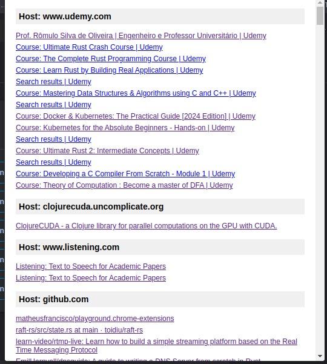
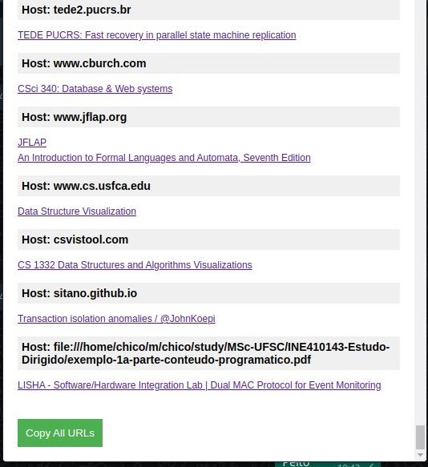

## Chrome plugin playground

Usually I open a lot of tabs in my browser and then sometimes I 
lost some of them, so I decided to create a plugin to help me.

this is a simple plugin that give you a list of all 
your open tabs in the browswer and you can copy them 
to save in a txt or save in some place.

## How to use

1. Clone this repository
2. Open your Chrome browswer
3. Go to `chrome://extensions/`
4. Enable the developer mode
5. Click in `Load unpacked`
6. Select the folder of this repository

## Image 

